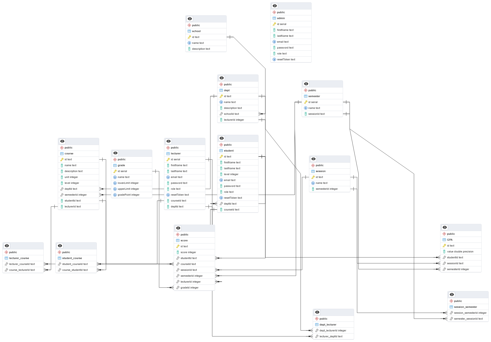

# Grade management system

An Express API written in TypeScript; that keeps track of student grades and GPA over the course of an academic year. Data is stored and handled in a PostgreSQL database.
This system is a component of a larger university management system.

## Prerequisites

To run this API, you will need the following:

- Node.js and npm installed
- PostgreSQL

To test the endpoints:
- [Postman](https://learning.postman.com/docs/introduction/overview/), [Insomnia](https://docs.insomnia.rest/), [curl](https://curl.se/docs/)


## Installation

1. Clone the repository:

```
git clone https://github.com/Meko007/grade-management.git
```

2. Install the dependencies:

```
npm install
```

3. Create a `.env` file in the root directory of the project and follow the [sample file](./.env.sample)

## Creating a PostgreSQL database using Prisma ORM

To install PostgreSQL head over to the [PostgreSQL webiste](https://www.postgresql.org/docs/current/index.html) and follow the steps to download, install and set it up for your operating system.

After installation, run the `npm run prisma-gen`, then the `npm run prisma-migrate` scripts.

## Running the API

Run the `npm run dev` script to start the development server.

The API will be available at `http://localhost:XXXX/api/v1`

## ERD (Entity Relationship Diagram)

Designed with pgAdmin (please zoom in for clarity)



## API Endpoints
